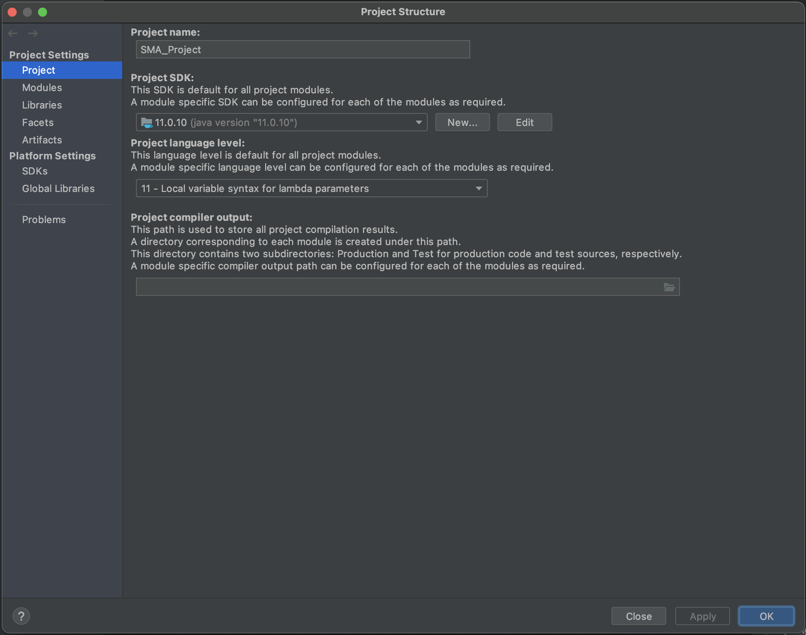

# [소검] 개발 시작 준비

> 작성자: 전도현(IMRaccoon)

 

1. [Git Clone](#1.-Git-Clone)
2. [프로젝트 시작하기](#2.-프로젝트-시작하기)
3. [프로젝트 설정](#3.-프로젝트-설정)
4. [프로젝트 실행](#4.-프로젝트-실행)
5. [예외사항](#예외사항)

---

## 1. Git Clone

- 개발하고자 하는 디렉토리에 Git Clone 해줍니다.  
  `git clone https://github.com/KUSVV-2021/SMA_Project.git`
  - 자체적으로 사용하고 있는 GitHub Desktop과 같은 프로그램을 사용하셔도 무관합니다.

 

## 2. 프로젝트 시작하기

- 이 후, IntelliJ를 실행한 뒤에 프로젝트를 Open 합니다.
- 열 때에는 `build.gradle` 파일을 클릭하여 열어줍니다.

    

- Gradle 이 설치되어 있다면 프로젝트를 열었을 시 하단에서 자동으로 Import 작업을 수행합니다.
- 작업이 끝난다면 아래와 같은 모습이 됩니다.

   

- 하단에 보이는 `Frameworks Detected` 팝업의 `Configure`를 누른 뒤 `OK`를 눌러줍니다.

  

- web.xml 파일을 확인하여 ClassPath에 Library를 추가해줍니다.

  

 

## 3. 프로젝트 설정

- `Project Structure` 를 열어줍니다.

  - window: `Ctrl+Alt+Shift+S`
  - mac: `⌘;`
  - 또는, File > Proejct Structure

- Project의 SDK가 11.0.10 임을 확인합니다.

  - 만약 되어있지 않은 경우, 설정하시면 됩니다.

    

- Module 에서 Spring 을 추가해줍니다.

  

  - 만약 이미 존재한다면 지우고 다시 만드시면 됩니다.

- Artifacts 를 추가합니다.

  - `Web Application: Exploded` > `From Modules...`

    

- Available Elements 의 항목들을 더블클릭하여 좌측으로 모두 옮겨준 뒤 Apply 합니다.

  

 

## 4. 프로젝트 실행

- 우측 상단에 있는 `Add Configuration...` 을 클릭합니다.

- Tomcat Server 를 추가해줍니다.

  

- 이 때, Tomcat은 로컬에 이미 설치되어있는 상태이어야 합니다.

  

  - 해당 사진 위쪽 + 버튼을 통해 설치한 tomcat의 디렉토리를 지정하여 설치할 수 있습니다.
  - 이름은 아무렇게나 지어도 상관없습니다.

- 이 후 하단의 `Warning: No artifacts marked for deployment` 에서 `Fix`를 클릭합니다.

  - 이전에 만든 Artifact를 적용해줍니다.
  - 이 때, 하단의 `Application context` 를 `/`로 설정해야 tomcat 실행 시, `/`로 매핑됩니다.

    

- 상단의 실행 표시가 활성화 되면 해당 버튼을 통해 실행할 수 있습니다.

  - `http://localhost:8080` 에서 Hello World를 볼 수 있다면 완성입니다

    

 

## 예외사항

- ### Build 시, java.long.NoClassDefFoundError: org/apache/tools/ant/util/ReaderInputStream

    

  - `File` > `Invalidate Caches / Restart...` 를 실행시켜 줍니다.

    
